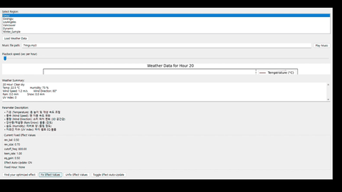

# 🎧 Weather-Sound Interaction System

An immersive audio interaction system that dynamically changes sound effects based on real-time weather data. Weather elements such as temperature, humidity, wind direction, wind speed, UV index, and precipitation influence musical parameters like filters, reverb, pitch, and volume, providing a responsive and engaging sonic experience.

---

## 🌦️ Weather-Based Sound Effects Chain

| Weather Factor       | Sound Effect                                | Description |
|----------------------|----------------------------------------------|-------------|
| **Temperature**       | 🎚 Low-Pass Filter (`ButLP`)<br>🎵 Pitch/Speed Control | Higher temperatures raise the cutoff frequency and increase playback speed, creating a brighter and faster sound. Lower temperatures make the sound darker and slower. |
| **Humidity**          | 🌫 Reverb (`Freeverb`)                        | Higher humidity adds more reverberation and spatial depth. |
| **Wind Speed**        | 🌬 Tremolo (Amplitude Modulation)            | Stronger winds cause faster amplitude modulation, adding a shaking effect. |
| **Wind Direction**    | 🧭 3D Spatialization (HRTF)                   | Changes the perceived direction of sound based on wind direction. |
| **Precipitation + Snowfall** | 🔊 Volume Scaling                        | Louder and more intense sound with increased rainfall or snowfall. |
| **UV Index**          | 🎚 High-Shelf EQ                              | Emphasizes high frequencies as the UV index increases. |

---

## 💻 Key Features & Technologies

### 🖼️ GUI & Event Handling
- Built with `wxPython` for a native desktop UI
- Includes sliders, buttons, and real-time parameter control

### 🔁 Asynchronous Processing / Threading
- Uses `threading.Thread` for background weather updates
- Keeps UI and audio processing smooth and responsive

### 🎵 Real-Time Audio Engine (`pyo`)
- Audio playback using `SfPlayer` and effects processing
- Real-time control of filters, volume, speed, and more
- Integrates effects: `Freeverb`, `ButLP`, `Tremolo`, `HRTF`

### 📊 Data Visualization
- Embedded `matplotlib` graphs for visualizing weather changes
- Displays temperature, humidity, and precipitation over time
- Shows the current playback position on the timeline

### 📁 Weather Data Parsing & Mapping
- Parses JSON weather data
- Converts numerical values to audio parameters (e.g., scaling, clamping)
- Allows manual override of volume and speed

---

## 🔧 Installation & Running

### 1. Install Required Packages

```bash
pip install wxPython pyo matplotlib
```

⚠️ `wxPython` can be tricky to install on some systems. Refer to the [official documentation](https://wxpython.org/pages/downloads/index.html) if you encounter issues.

---

### 2. Run the Application

```bash
python final_with_effect_opt.py
```
or

```bash
python final_sonification.py
```
---
## 🎬 Demo
final_with_effect_opt.py


---
## 🎯 Feature Summary

| Sound Design Element     | Implementation Detail                                 |
|--------------------------|--------------------------------------------------------|
| Low-Pass Filter          | Temperature-based cutoff frequency (ButLP)             |
| Reverb                   | Humidity-based wet/dry mix and decay (Freeverb)        |
| Tremolo                  | Wind speed-based amplitude modulation                  |
| Spatial Audio (HRTF)     | Wind direction-based stereo/spatial panning            |
| Volume Control           | Based on precipitation and snowfall                    |
| Pitch / Speed Control    | Controlled by temperature                              |
| EQ (High Shelf Boost)    | Based on UV index                                      |

---

## 📌 Notes

This project is an experimental audio system that turns real-time weather data into immersive musical experiences.

You can connect it to a live weather API or use historical weather data for testing and demonstration.

---

## 📜 License

This project is licensed under the MIT License.

---

## 🙋‍♀️ Contribution

Contributions are welcome! Feel free to submit a Pull Request or open an issue for bug reports or enhancement ideas.
